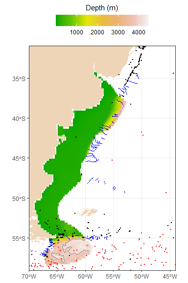
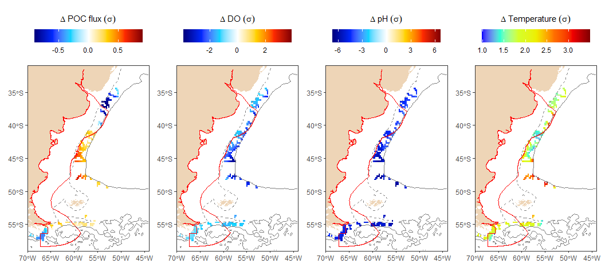
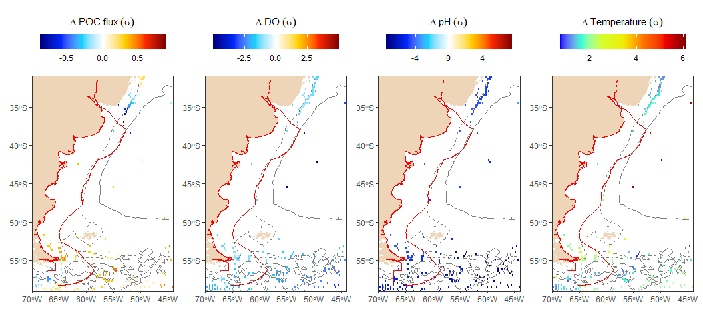
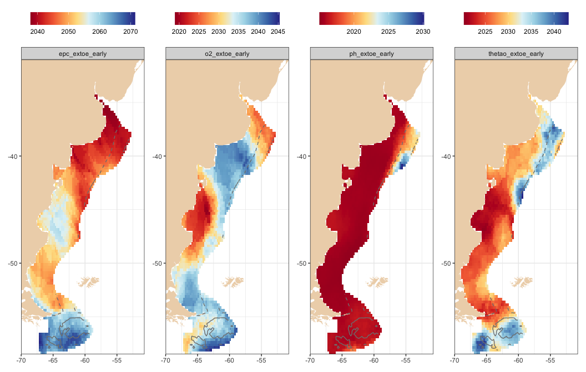
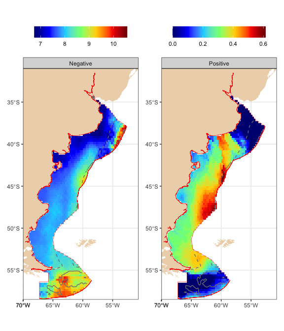
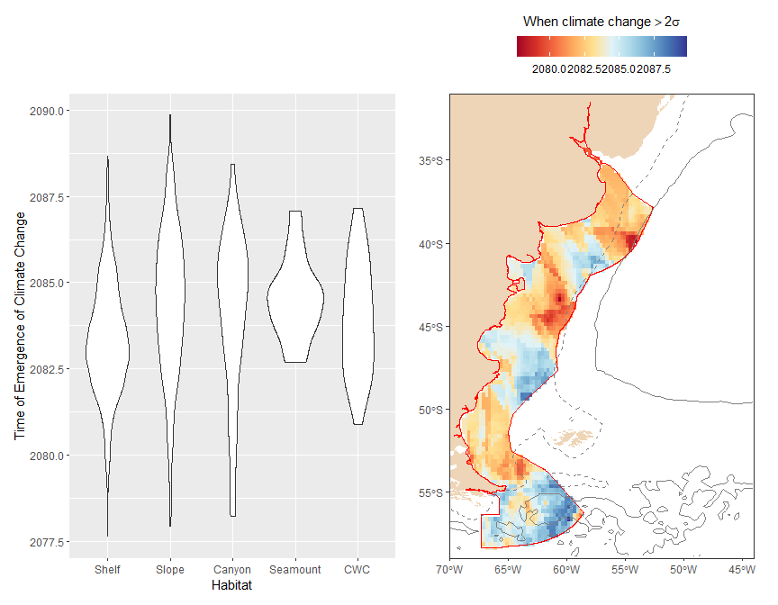
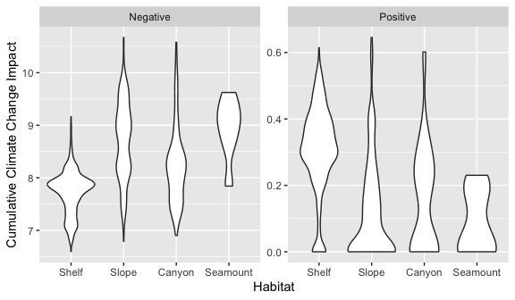
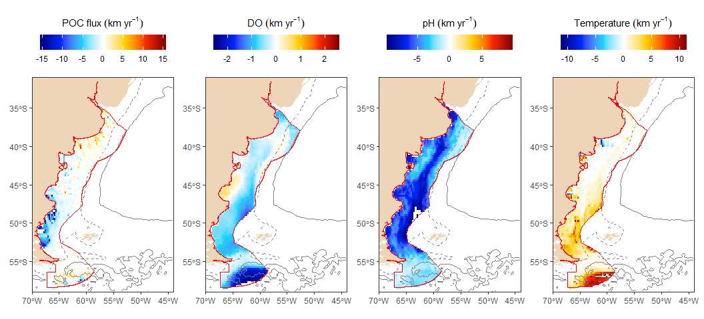

Extract seafloor climate change data by polygon
================
Chih-Lin Wei
2024-07-25

``` r
library(ArgentinaSSP126)
library(ggplot2)
library(dplyr)
library(patchwork)
library(tidyr)
library(RColorBrewer)
```

# Extract data by Argentina EEZ polygon

In this analysis, we want to extract and display the seafloor climate
change data for [Argentina
EEZ](https://marineregions.org/gazetteer.php?p=details&id=8466). We can
do that by
[mask](https://www.rdocumentation.org/packages/raster/versions/3.6-26/topics/mask)
the
[etopo2022](https://www.ncei.noaa.gov/products/etopo-global-relief-model)
raster with Argentina EEZ. We can see that the Argentina EEZ consisting
of continental shelf (0-200 m) and continental slope (200-4000 m).

``` r
bathy <- etopo2022  %>% mask(eez) %>% as.data.frame(xy = TRUE) %>% na.omit
ggplot(bathy) +
      geom_raster(aes(x=x, y=y, fill=-layer))+
      geom_polygon(data=arg, aes(x=X, y=Y, group=PID), fill="bisque2", colour="transparent")+
      geom_polygon(data=fortify(eez), aes(x=long, y=lat, group=id), fill="transparent", colour="red")+
      geom_contour(data=bathy, aes(x=x, y=y, z=layer), breaks=-200, linetype=2, colour="gray50")+
      geom_contour(data=bathy, aes(x=x, y=y, z=layer), breaks=-4000, linetype=1, colour="gray50")+
      scale_fill_gradientn(colours=terrain.colors(7))+
      scale_x_continuous(expand = expansion(mult = 0))+
      scale_y_continuous(expand = expansion(mult = 0))+
      labs(x=NULL, y=NULL, fill=NULL)+
      coord_fixed(1.52)+
      theme_bw() %+replace% theme(legend.position = "top", legend.key.width =  unit(1, 'cm'))
```

<!-- -->

We can use the same [ggplot](https://ggplot2.tidyverse.org/) wrap
function to generate multi-panel plots. The custom plot function use the
same three parameters, including: + r: A rasterbrick containing the
data. + colours: A vector of colors to use for the color key. + limits:
A numeric vector of length two providing quantile limits for the color
key scale.

``` r
plot_fun <- function(r, colours=NULL, q_limits=c(0.001, 0.999)){
  
  # Convert raster to data frame and then to list
  cmip6_list <- as.data.frame(r, xy = TRUE) %>% na.omit %>%
  gather(-x, -y, key = "var", value = "value") %>%
  group_split(var)
  
  # Depth
  bathy <- mask(etopo2022, eez)%>% as.data.frame(xy = TRUE) %>% na.omit
  
  # ggolot list
  gg_list = lapply(cmip6_list, function(dat) {
    
    # Color key limits and colours
    lim1 <- quantile(dat$value, q_limits, na.rm=TRUE)
    lim2 <- max(abs(quantile(dat$value, q_limits, na.rm=TRUE)))
    if(min(lim1) >= 0) {
      lims <- lim1; cols <- jet.colors(7)
    } else {
      lims <- c(-lim2, lim2); cols <- jet.colors3(7)}
    if(is.null(colours)) cols <- cols else cols <- colours
      
    # Plot raster layer
    ggplot(dat) +
      geom_raster(aes(x=x, y=y, fill=value))+
      geom_polygon(data=arg, aes(x=X, y=Y, group=PID), fill="bisque2", colour="transparent")+
      geom_polygon(data=fortify(eez), aes(x=long, y=lat, group=id), fill="transparent", colour="red")+
      geom_contour(data=bathy, aes(x=x, y=y, z=layer), breaks=-200, linetype=2, colour="gray50")+
      geom_contour(data=bathy, aes(x=x, y=y, z=layer), breaks=-4000, linetype=1, colour="gray50")+
      scale_fill_gradientn(colours=cols, limits=lims)+
      scale_x_continuous(expand = expansion(mult = 0))+
      scale_y_continuous(expand = expansion(mult = 0))+
      labs(x=NULL, y=NULL, fill=NULL)+
      coord_fixed(1.52)+
      facet_wrap(~ var) +
      theme_bw() %+replace% theme(legend.position = "top", legend.key.width =  unit(1, 'cm'))
      })
  
  # Wrap ggplot list
  wrap_plots(gg_list, nrow=1)
}
```

# Climate change hazards

For example, we can mask the climate change hazards between 2041 and
2060 by the Argentina EEZ polygon. The following maps show the degree of
climate change (or climate change hazards) by 2041 to 2060 in the unit
of historical variability during 1951 to 2000.

``` r
plot_fun(r=cmip6_2041_2060_exsd %>% subset(1:4) %>% mask(eez))
```

<!-- -->

We can also use violin plots to show climate change hazards within
Argentina EEZ separated by 200-m depth contour (i.e., continental shelf
vs. slope).

``` r
out <- addLayer(etopo2022, cmip6_2041_2060_exsd %>% subset(1:4)) %>% mask(eez) %>% as.data.frame(xy = TRUE) %>% na.omit
out$Region <- cut(-out$layer, c(0, 200, 5000), labels=c("Shelf", "Slope"))

ggplot(data=out %>% gather(-x, -y, -layer, -Region, key = "var", value = "value"))+
  geom_violin(aes(x=Region, y=value))+
  facet_wrap(~var, scales="free", nrow=1)+
  labs(y="Climate Change Hazards")
```

<!-- -->

# Time of emergence of climate changes

The following maps and violin plots illustrate when climate changes
exceed two times the historical standard deviation (or the year when the
value of climate change hazards \> 2). We use two times the standard
deviation because in a roughly normal data set, values within one
standard deviation of the mean account for about 68% of the set, while
values within two standard deviations account for about 95%.

``` r
plot_fun(cmip6_extoe_early %>% subset(1:4) %>% mask(eez), colours = brewer.pal(10, 'RdYlBu'), q_limits = c(0, 1))
```

<!-- -->

``` r
out <- addLayer(etopo2022, cmip6_extoe_early %>% subset(1:4)) %>% mask(eez) %>% as.data.frame(xy = TRUE) %>% na.omit
out$Region <- cut(-out$layer, c(0, 200, 5000), labels=c("Shelf", "Slope"))

ggplot(data=out %>% gather(-x, -y, -layer, -Region, key = "var", value = "value"))+
  geom_violin(aes(x=Region, y=value))+
  facet_wrap(~var, scales="free", nrow=1)+
  labs(y="Time of Emergence of Climate Change")
```

<!-- -->

Next, we show the years when climate changes for export POC flux,
dissolved oxygen, pH, and temperature simultaneously exceed twice the
historical variability.

``` r
all <- overlay(subset(cmip6_extoe_early, 1:4), fun=max) %>% mask(eez) %>% as.data.frame(xy = TRUE) %>% na.omit
bathy <- etopo2022 %>% mask(eez) %>% as.data.frame(xy = TRUE) %>% na.omit
p1 <- ggplot(all) +
      geom_raster(aes(x=x, y=y, fill=layer))+
      geom_polygon(data=arg, aes(x=X, y=Y, group=PID), fill="bisque2", colour="transparent")+
      geom_polygon(data=fortify(eez), aes(x=long, y=lat, group=id), fill="transparent", colour="red")+
      geom_contour(data=bathy, aes(x=x, y=y, z=layer), breaks=-200, linetype=2, colour="gray50")+
      geom_contour(data=bathy, aes(x=x, y=y, z=layer), breaks=-4000, linetype=1, colour="gray50")+
      scale_fill_gradientn(colours=brewer.pal(10, 'RdYlBu'))+
      scale_x_continuous(expand = expansion(mult = 0))+
      scale_y_continuous(expand = expansion(mult = 0))+
      labs(x=NULL, y=NULL, fill=NULL)+
      coord_fixed(1.52)+
      theme_bw() %+replace% theme(legend.position = "right", legend.key.height =  unit(1.8, 'cm'))

# Violin plots
out <- addLayer(etopo2022, overlay(subset(cmip6_extoe_early, 1:4), fun=max)) %>% mask(eez) %>% as.data.frame(xy = TRUE) %>% na.omit
out$Region <- cut(-out$layer.1, c(0, 200, 5000), labels=c("Shelf", "Slope"))

p2 <- ggplot(data=out)+
  geom_violin(aes(x=Region, y=layer.2))+
  labs(y="Time of Emergence of Climate Change")
```

``` r
p2+p1+plot_layout(widths = c(1, 2))
```

<!-- -->

# Cumulative impact of climate change hazards

Another application involves calculating the cumulative impacts of
climate change hazards. The negative hazards are caused by declining
export POC flux, deoxygenation, ocean acidification, and ocean warming.
The positive impacts are increasing export POC flux, oxygenation, ocean
basification, and ocean cooling. Here, we use the same function to
calculate cumulative negative and positive impacts caused by climate
change hazards.

``` r
cum_imp <- function(r){
  # Negative cumulative impact (exposure to climate change hazards for epc<0, o2<0, ph<0, and thetao>0)
  n2050 <- addLayer(calc(subset(r, 1:3), fun=function(x){x[x>0]<-NA; return(-x)}),
                    calc(subset(r, 4), fun=function(x){x[x<0]<-NA; return(x)})
                    ) %>%　overlay(fun=function(x)sum(x, na.rm=T))

  # Positive cumulative impact (exposure to climate change hazards for epc>0, o2>0, ph>0, and thetao<0)
  p2050 <- addLayer(calc(subset(r, 1:3), fun=function(x){x[x<0]<-NA; return(x)}),
                    calc(subset(r, 4), fun=function(x){x[x>0]<-NA; return(-x)})
                    ) %>%　overlay(fun=function(x)sum(x, na.rm=T))
  
  out <- addLayer(n2050, p2050)
  names(out) <- c("Negative", "Positive")
  out <- mask(out, etopo2022)
  return(out)
}
```

``` r
plot_fun(r=cum_imp(cmip6_2041_2060_exsd) %>% mask(eez))
```

<!-- -->

``` r
out <- addLayer(etopo2022, cum_imp(cmip6_2041_2060_exsd)) %>% mask(eez) %>% as.data.frame(xy = TRUE) %>% na.omit
out$Region <- cut(-out$layer, c(0, 200, 5000), labels=c("Shelf", "Slope"))

ggplot(data=out %>% gather(-x, -y, -layer, -Region, key = "var", value = "value"))+
  geom_violin(aes(x=Region, y=value))+
  facet_wrap(~var, scales="free")+
  labs(y="Cumulative Climate Change Impact")
```

<!-- -->

# Climate velocity

An important factor for the survival of species is how quickly they need
to move to adjust to current environmental conditions and keep up with
climate changes. Local climate velocity can be calculated by measuring
the rate of change of a specific variable (like temperature) over time
and dividing it by the corresponding spatial gradient of that variable
within a 3x3 area. Areas with low local climate velocities may be good
candidates for protection, as they could potentially act as climatic
refuges and are often associated with high levels of endemic species.
It’s important to note that in deep seafloor environments, like the
abyssal plain, the spatial gradient may be small, resulting in high
climate velocities. In our example, we display the average seafloor
gradient-based climate velocity magnitudes from 2041 to 2060 within
Argentina EEZ.

``` r
plot_fun(cmip6_2041_2060_voccMeg %>% subset(1:4) %>% mask(eez), q_limits=c(0.01, 0.99))
```

<!-- -->

``` r
out <- addLayer(etopo2022, cmip6_2041_2060_voccMeg %>% subset(1:4)) %>% mask(eez) %>% as.data.frame(xy = TRUE) %>% na.omit
out$Region <- cut(-out$layer, c(0, 200, 5000), labels=c("Shelf", "Slope"))

ggplot(data=out %>% gather(-x, -y, -layer, -Region, key = "var", value = "value"))+
  geom_violin(aes(x=Region, y=value))+
  facet_wrap(~var, scales="free", nrow=1)+
  labs(y="Climate Velocity Magnitudes")
```

<!-- -->

# Cumulative impact based on climate velocity

We can calculate the overall negative impact of climate velocity by
taking into account the impacts of decreasing food supply,
deoxygenation, acidification, and warming, as well as the positive
impact of increasing food supply, oxygen levels, ocean basification, and
cooling. Conversely, the increase in export POC flux, oxygen levels,
ocean basification, and ocean cooling can be considered as cumulative
positive impacts.

``` r
plot_fun(r=cum_imp(cmip6_2041_2060_voccMeg) %>% mask(eez), q_limits = c(0, 0.99))
```

<!-- -->

``` r
out <- addLayer(etopo2022, cum_imp(cmip6_2041_2060_voccMeg)) %>% mask(eez) %>% as.data.frame(xy = TRUE) %>% na.omit
out$Region <- cut(-out$layer, c(0, 200, 5000), labels=c("Shelf", "Slope"))

ggplot(data=out %>% gather(-x, -y, -layer, -Region, key = "var", value = "value"))+
  geom_violin(aes(x=Region, y=value))+
  facet_wrap(~var, scales="free")+
  labs(y="Cumulative Climate Change Impact")
```

<!-- -->
