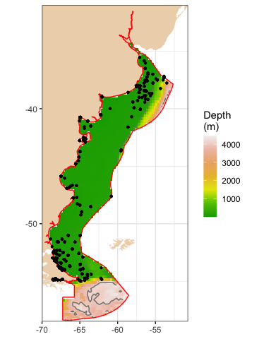
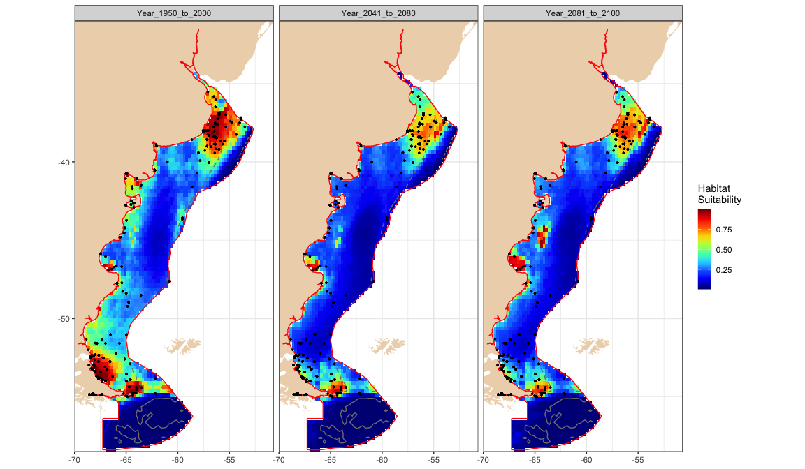

Extract seafloor climage change data by coordinate
================
Chih-Lin Wei
2024-07-25

``` r
library(ArgentinaSSP126)
library(ggplot2)
library(dplyr)
library(tidyr)
```

For example, we first download Demospongiae occurrence data from
[OBIS](https://obis.org/area/7) using the
[occurrence](https://www.rdocumentation.org/packages/robis/versions/2.11.3/topics/occurrence)
function from the
[robis](https://www.rdocumentation.org/packages/robis/versions/2.11.3)
package. You may choose any other species from
[OBIS](https://obis.org/area/7) and no. 7 is the area ID for Argentina.
Here, let’s look at the first ten records as an example.

``` r
library(robis)
library(knitr)
library(kableExtra)

occ <- occurrence(scientificname = "Demospongiae", areaid = 7)
head(occ[, c(1:3, 5:6)], 10) %>% kable
```

| basisOfRecord    | decimalLatitude | decimalLongitude | occurrenceStatus | scientificName                          |
|:-----------------|----------------:|-----------------:|:-----------------|:----------------------------------------|
| HumanObservation |       -38.01000 |        -57.08000 | Presence         | Lissodendoryx (Ectyodoryx) nobilis      |
| HumanObservation |       -44.21000 |        -65.11000 | Presence         | Trachytedania spinata                   |
| HumanObservation |       -42.64083 |        -64.24525 | NA               | Demospongiae                            |
| HumanObservation |       -42.62378 |        -64.26614 | NA               | Clathria                                |
| HumanObservation |       -52.50000 |        -67.23300 | Presence         | Tedania (Tedania)                       |
| HumanObservation |       -42.62406 |        -64.26022 | NA               | Demospongiae                            |
| HumanObservation |       -37.28330 |        -53.86670 | NA               | Latrunculia (Aciculatrunculia) apicalis |
| HumanObservation |       -42.62406 |        -64.26022 | NA               | Clathria                                |
| HumanObservation |       -53.83330 |        -67.66670 | present          | Haliclona (Reniera) topsenti            |
| HumanObservation |       -37.28330 |        -53.86670 | Presence         | Semisuberites cribrosa                  |

There are a total of 2617 occurrence records within the [Argentina
EEZ](https://marineregions.org/gazetteer.php?p=details&id=8466). We can
then overlay them on top of the
[etopo2022](https://www.ncei.noaa.gov/products/etopo-global-relief-model)
raster to see the data distribution.

``` r
bathy <- etopo2022 %>% mask(eez) %>% as.data.frame(xy = TRUE) %>% na.omit
ggplot(bathy) +
  geom_raster(aes(x=x, y=y, fill=-layer))+
  geom_polygon(data=arg, aes(x=X, y=Y, group=PID), fill="bisque2", colour="transparent")+
  geom_polygon(data=fortify(eez), aes(x=long, y=lat, group=id), fill="transparent", colour="red")+
  geom_contour(data=bathy, aes(x=x, y=y, z=layer), breaks=-200, linetype=2, colour="gray50")+
  geom_contour(data=bathy, aes(x=x, y=y, z=layer), breaks=-4000, linetype=1, colour="gray50")+
  geom_point(data=occ, aes(x=decimalLongitude, y=decimalLatitude), size=0.8)+
  scale_fill_gradientn(colours=terrain.colors(7))+
  scale_x_continuous(expand = expansion(mult = 0))+
  scale_y_continuous(expand = expansion(mult = 0))+
  labs(x=NULL, y=NULL, fill="Depth\n(m)")+
  coord_fixed(1.52)+
  theme_bw() %+replace% theme(legend.position = "right", legend.key.width =  unit(0.5, 'cm'))
```

<!-- -->

Besides extracting data for each coordinate, we can also apply these
data for simple habitat suitability modeling using
[Maxent](https://www.rdocumentation.org/packages/dismo/versions/1.3-14/topics/maxent)
from the
[dismo](https://www.rdocumentation.org/packages/dismo/versions/1.3-14)
package. Here, we’d like to model the Demospongiae occurrence using the
historical projection from 1950 to 2000 and then use the
[Maxent](https://www.rdocumentation.org/packages/dismo/versions/1.3-14/topics/maxent)
model to predict the habitat suitability of Demospongiae in 2041 to 2060
and 2081 and 2100. We need three sets of climate change data for 1950 to
2000, 2041 to 2060, and 2081 to 2100. Because water depth is usually the
most critical factor controlling the Demospongiae distribution, we also
add the
[etopo2022](https://www.ncei.noaa.gov/products/etopo-global-relief-model)
global relief model into the predictors. The predictor names are
modified (e.g., removing the years) to be consistent across three
periods for the convenience of modeling and predictions.

``` r
hist <- addLayer(etopo2022, cmip6_1950_2000_av) %>% mask(eez)
names(hist)[-1] <- gsub("_av_1950_to_2000", "", names(cmip6_1950_2000_av))

proj1 <- addLayer(etopo2022, cmip6_2041_2060_av) %>% mask(eez)
names(proj1)[-1] <- gsub("_av_2041_2060", "", names(cmip6_2041_2060_av))

proj2 <- addLayer(etopo2022, cmip6_2081_2100_av) %>% mask(eez)
names(proj2)[-1] <- gsub("_av_2081_2100", "", names(cmip6_2081_2100_av))
```

The commands in
[Maxent](https://www.rdocumentation.org/packages/dismo/versions/1.3-14/topics/maxent)
are pretty simple. We only need a raster brick of predictors and
coordinates of species occurrence to create a model. The historical and
future habitat suitability of Demospongiae can then be
[predicted](https://www.rdocumentation.org/packages/dismo/versions/1.3-14/topics/predict)
using seafloor climate change data from the model. As a demonstration,
we will skip all other details, such as the model validation,
performance or variable importance, etc. More details on applying Maxent
and other species distribution modeling methods can be found in [Hijmans
and Elith (2023)](https://rspatial.org/raster/sdm/raster_SDM.pdf).

``` r
library(dismo)

loc <- occ[, c("decimalLongitude", "decimalLatitude")]
coordinates(loc) <- c("decimalLongitude", "decimalLatitude")
me <- maxent(hist, loc)

r <- addLayer(predict(me, hist), predict(me, proj1), predict(me, proj2))
names(r) <- c("Year_1950_to_2000", "Year_2041_to_2080", "Year_2081_to_2100")
```

We can use the
[extract](https://www.rdocumentation.org/packages/raster/versions/3.6-23/topics/extract)
function to take a quick look at the historical predictors used in the
model. This predictor table is corresponded to the previous Demospongiae
occurrence table.

``` r
raster::extract(hist, loc) %>% head(10) %>% kable(digits=3)
```

|     layer |    epc |    o2 |    ph | thetao | arag | calc |   co3 | co3satarag | co3satcalc | aragsat | calcsat |
|----------:|-------:|------:|------:|-------:|-----:|-----:|------:|-----------:|-----------:|--------:|--------:|
|   -41.299 | 40.493 | 0.265 | 8.094 |  9.675 |    0 |    0 | 0.151 |      0.068 |      0.043 |   2.129 |   2.850 |
|   -52.222 | 70.588 | 0.272 | 8.079 |  8.644 |    0 |    0 | 0.141 |      0.068 |      0.043 |   2.359 |   2.648 |
|        NA |     NA |    NA |    NA |     NA |   NA |   NA |    NA |         NA |         NA |      NA |      NA |
|   -72.107 | 62.435 | 0.266 | 8.096 | 10.680 |    0 |    0 | 0.157 |      0.068 |      0.043 |   2.563 |   2.953 |
|   -92.298 | 97.392 | 0.297 | 8.082 |  5.849 |    0 |    0 | 0.124 |      0.069 |      0.043 |   1.911 |   2.334 |
|   -72.107 | 62.435 | 0.266 | 8.096 | 10.680 |    0 |    0 | 0.157 |      0.068 |      0.043 |   2.563 |   2.953 |
| -1136.211 | 25.874 | 0.211 | 7.952 |  5.026 |    0 |    0 | 0.117 |      0.104 |      0.064 |   1.223 |   1.702 |
|   -72.107 | 62.435 | 0.266 | 8.096 | 10.680 |    0 |    0 | 0.157 |      0.068 |      0.043 |   2.563 |   2.953 |
|        NA |     NA |    NA |    NA |     NA |   NA |   NA |    NA |         NA |         NA |      NA |      NA |
| -1136.211 | 25.874 | 0.211 | 7.952 |  5.026 |    0 |    0 | 0.117 |      0.104 |      0.064 |   1.223 |   1.702 |

inally, we map the projected habitat suitability of Demospongiae for the
years 1950 to 2000, 2041 to 2060, and 2081 to 2100. We can see that
habitat suitability will decrease toward the end of the 21st century.

``` r
dat <- r%>% as.data.frame(xy = TRUE) %>% na.omit %>% gather(-x, -y, key = "var", value = "value")
ggplot(dat) +
  geom_raster(aes(x=x, y=y, fill=value))+
  geom_polygon(data=arg, aes(x=X, y=Y, group=PID), fill="bisque2", colour="transparent")+
  geom_polygon(data=fortify(eez), aes(x=long, y=lat, group=id), fill="transparent", colour="red")+
  geom_contour(data=bathy, aes(x=x, y=y, z=layer), breaks=-200, linetype=2, colour="gray50")+
  geom_contour(data=bathy, aes(x=x, y=y, z=layer), breaks=-4000, linetype=1, colour="gray50")+
  geom_point(data=occ, aes(x=decimalLongitude, y=decimalLatitude), size=0.5)+
  facet_wrap(~var, nrow=1)+
  scale_fill_gradientn(colours=jet.colors(10))+
  scale_x_continuous(expand = expansion(mult = 0))+
  scale_y_continuous(expand = expansion(mult = 0))+
  labs(x=NULL, y=NULL, fill="Habitat\nSuitability")+
  coord_fixed(1.52)+
  theme_bw() %+replace% theme(legend.position = "right", legend.key.width =  unit(0.5, 'cm'))
```

<!-- -->
